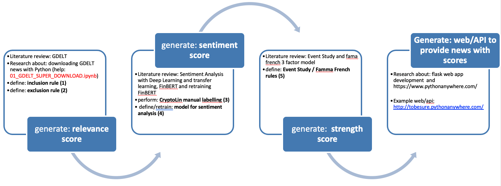

# Crypto_Curated_Database

# Relevance Score - FinBert Model #1
Define the Inclusion & Exclusion rule:
- Labelled as Excluded (0): https://news.yahoo.com/
- Labelled as Excluded (0): https://finance.yahoo.com/
- Labelled as Included (1): https://finance.yahoo.com/topic/crypto

Retrain the FinBERT algorithm for Relevance Score

# Sentiment Score - FinBert Model #2
Manual labelling of [ Crypto Coin Market news] (https://coinmarketcal.com/en/news) after webscraping:
- Positive (1)
- Negative (-1)
- Neutral (0)

Retrain the FinBERT algorithm for Sentiment Score

# Strength Score - FinBert Model #3
News Impact on Stock Market (Rule of thumb):
- (-2 days) before the news are published due to privilege information or information leaks
- (+4 days) after the news are published

Mean of the crypto volatility through these days to see if we have an Abnormal or Normal return.
- Abnormal (1): Datapoint more than Two-std deviations of the sample distribution
- Normal (0): Datapoint less than Two-std deviations of the sample distribution

# Web/API

- Flask App
- Hosted in python anywhere
